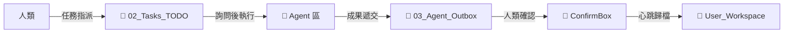

# 07_Workspace_Collaboration: 雙工作區協作流程

> **讓 Agent 與人類各守主場，成果有序遞交**

---

## 雙工作區概念



| 區域 | 路徑 | 角色 |
|------|------|------|
| **🧠 Agent 區** | `_Agent_System/` | Agent 主場（草稿、記憶、日誌） |
| **📂 人類區** | `_User_Workspace/` | 人類主場（正式成果） |

---

## 成果遞交流程

### 標準流程

```
1. Agent 完成任務
   ↓
2. 成果放入 `_Agent_System/03_Agent_Outbox/`
   ↓
3. 通知人類：「成果已放入 Outbox，請確認」
   ↓
4. 人類確認 → 移至 `03_Agent_Outbox/ConfirmBox/`
   ↓
5. Agent 心跳 → 自動歸檔至正式位置
```

### 範例

```markdown
📤 [成果遞交]
檔案：專案進度報告_2026Q1.md
位置：_Agent_System/03_Agent_Outbox/
目標：_User_Workspace/10_Reports/

請確認後移至 ConfirmBox/
```

---

## 心跳檢查差異

| 區域 | 處理方式 | 說明 |
|:---|:---|:---|
| `01_Inbox/` | 🟢 **自動處理** | Agent 可自主分類，遇問題才提給人類 |
| `02_Tasks_TODO/` | 🔴 **詢問人類** | 這是人類指派的任務，需確認再執行 |
| `03_Agent_Outbox/ConfirmBox/` | 🟢 **自動歸檔** | 人類已確認，可直接移至正式位置 |

---

## 範例目錄結構

```
_Agent_System/
├── 01_Inbox/                  # Agent 自動處理
│   ├── 未分類筆記_001.md
│   └── 待整理資料.txt
│
├── 02_Tasks_TODO/             # 人類指派，需詢問
│   ├── 撰寫報告.md
│   └── 更新文件.md
│
├── 03_Agent_Outbox/           # Agent 成果輸出
│   ├── 草稿_報告.md
│   └── ConfirmBox/            # 待歸檔
│       └── 確認_報告.md
```

---

## 實作模板

👉 [AGENTS.md.template](AGENTS.md.template) - 包含完整協作規則

---

> 返回 [總覽](00_Overview.md)
