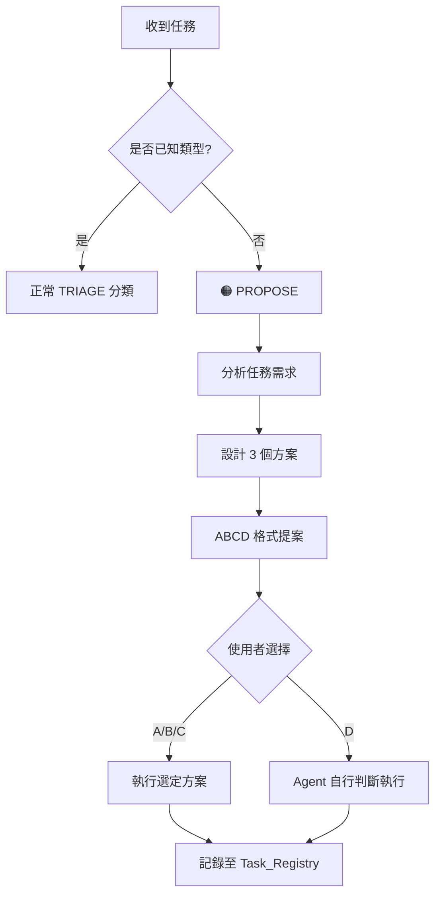

# 15_New_Task_Handler: 未知任務處理

> **當 Agent 遇到未定義的任務類型時，如何優雅處理？**

---

## 為什麼需要這個模組？

AI Agent 不可能預先知道所有任務類型。當遇到「沒有 SOP」的任務時，與其亂猜或報錯，不如讓 Agent **主動提案**，讓人類做決定。

這就是 TRIAGE 系統中 **🟠 PROPOSE** 分類的核心邏輯。

---

## 觸發條件

符合**任一**條件即觸發：

1. 任務類型不在 `CAPABILITIES.md` 定義範圍內
2. 查詢 `Task_Registry.md` 無匹配記錄
3. 沒有現成的處理模式/SOP 可套用

---

## 處理流程



---

## ABCD 提案格式

這是 Agent 向人類提案的標準格式：

```
[方案提案] {任務簡述}

🔑 關鍵節點：
1. {需要決策的關鍵點1}
2. {需要決策的關鍵點2}

📋 方案選項：

**A 方案**（保守/安全路線）
- 描述：{說明}
- 優點：{優點}
- 風險：低

**B 方案**（平衡/推薦路線）⭐
- 描述：{說明}
- 優點：{優點}
- 風險：中

**C 方案**（進取/完整路線）
- 描述：{說明}
- 優點：{優點}
- 風險：高

**D 直接執行**
- 由 Agent 根據情境自行判斷最佳方案
- 執行後會回報採用的方案

---

請選擇 (A/B/C/D)：
```

---

## 方案設計原則

| 方案 | 定位 | 適用場景 |
|:---:|:---|:---|
| **A** | 保守 | 不確定性高、首次嘗試、影響範圍大 |
| **B** | 平衡 | 一般情況的推薦選擇 |
| **C** | 進取 | 熟悉領域、時間充裕、追求完整 |
| **D** | 委託 | 信任 Agent 判斷、快速處理 |

---

## 實作模板

👉 [NEW_TASK_HANDLER.md.template](_starter_kit/config/NEW_TASK_HANDLER.md.template)

---

> 返回 [總覽](00_Overview.md)
