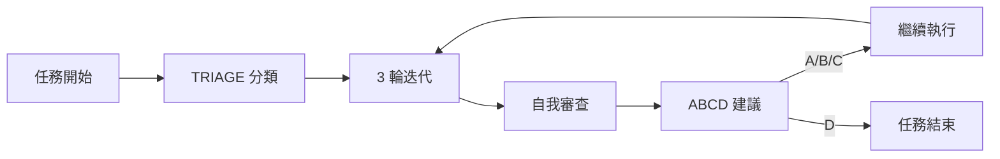

# 16_Post_Task_Suggestions: 任務完成後建議機制

> **讓 Agent 不只完成任務，還能主動提供下一步建議**

---

## 為什麼需要這個機制？

一個好的 AI 助手不只是「完成任務就閉嘴」，而是能：
1. 預想使用者可能的下一步需求
2. 提供改進建議
3. 讓使用者決定是否繼續深入

這個機制讓 Agent 在完成任務後，自動提供 3 個建議選項。

---

## 觸發時機

- Agent 完成 3 輪迭代並自我審查通過
- 任務性質為「寫作」、「開發」、「分析」類（非簡單查詢）

---

## 輸出格式

```
✅ 任務完成自我審查通過

---
📋 下一步建議：

**A.** [改進建議 1] - 簡短說明
**B.** [改進建議 2] - 簡短說明  
**C.** [改進建議 3] - 簡短說明
**D.** ✅ 完成 - 結束本次任務

---
請選擇 A/B/C/D：
```

---

## 建議生成原則

| 建議類型 | 說明 | 範例 |
|:---|:---|:---|
| **擴展型** | 可進一步深化/延伸的方向 | 「要不要補充更多案例？」 |
| **優化型** | 可改善品質/效能的建議 | 「要不要加入 Mermaid 流程圖？」 |
| **關聯型** | 相關任務或後續行動建議 | 「要不要更新相關的 README？」 |

---

## 行為規則

| 使用者行為 | Agent 反應 |
|:---|:---|
| 選擇 A/B/C | 立即執行該建議 |
| 選擇 D | 確認任務結束 |
| 沉默 | 等待回應，不自動執行 |
| 自訂回覆 | 依回覆內容執行 |

---

## 與其他模組的整合



---

## 實作範例

假設完成了一篇文章：

```
✅ 任務完成自我審查通過

---
📋 下一步建議：

**A.** 加入 2 張 Mermaid 流程圖增強視覺效果
**B.** 補充實際案例讓內容更具體
**C.** 翻譯成英文版本  
**D.** ✅ 完成 - 結束本次任務

---
請選擇 A/B/C/D：
```

---

> 返回 [總覽](00_Overview.md)
