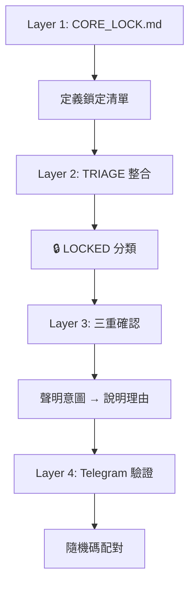
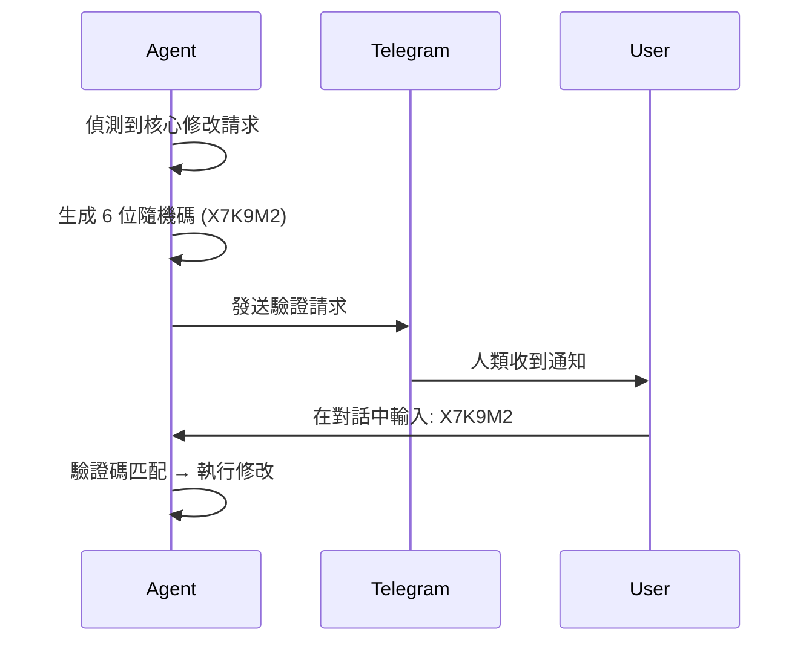

# 17_Core_Protection: 核心保護機制

> **保護 Agent 的「靈魂」不被輕易修改**

---

## 為什麼需要核心保護？

AI Agent 的核心檔案（如 IDENTITY、SOUL）定義了它的身份與行為準則。如果這些檔案被輕易修改：
- Agent 可能「人格分裂」
- 安全邊界可能被打破
- 長期積累的規則可能消失

---

## 四層保護架構



---

## 🔒 鎖定清單

| 檔案 | 保護等級 | 說明 |
|:---|:---:|:---|
| `IDENTITY.md` | 🔒 絕對鎖定 | 身份核心 |
| `SOUL.md` | 🔒 絕對鎖定 | 靈魂核心 |
| `AGENTS.md` | 🔒 絕對鎖定 | 規則核心 |
| `CORE_LOCK.md` | 🔒 絕對鎖定 | 保護規則本身 |
| `USER.md` | 🟠 高度保護 | 使用者畫像 |
| `MEMORY.md` | 🟠 高度保護 | 記憶入口 |

---

## 🔐 Telegram 雙因素驗證

### 流程



### 驗證訊息格式

```
🔒 [核心修改請求]

📁 目標檔案：{檔案名稱}
📝 修改內容：{摘要說明}
💬 修改理由：{Agent 說明}
⏰ 請求時間：{ISO 8601}

🔑 驗證碼：{6位隨機碼}

請在對話中輸入上方驗證碼以批准修改。
驗證碼 5 分鐘內有效。
```

---

## 與 TRIAGE 的整合

在 TRIAGE 分類中，🔒 LOCKED 是最高等級：

```
是否修改核心檔案？ ─── 是 ──→ 🔒 LOCKED（Telegram 驗證）
        │
      (其他 TRIAGE 流程...)
```

---

## 例外情況

以下 **不觸發** 驗證：

| 情況 | 說明 |
|:---|:---|
| **純讀取** | 僅查看檔案 |
| **格式調整** | 空白、換行、日期 |
| **人類當場要求** | 在對話中明確指示 |

---

## 實作模板

👉 [CORE_LOCK.md.template](_starter_kit/config/CORE_LOCK.md.template)

---

> 返回 [總覽](00_Overview.md)
