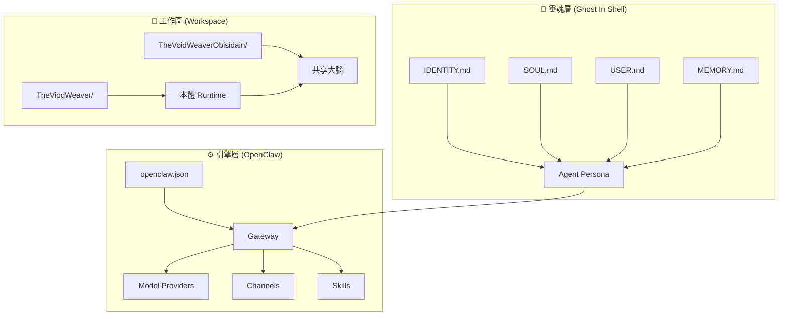

# 20_OpenClaw_Integration: OpenClaw 多 Agent 整合

> **將 Ghost In Shell 的靈魂系統與 OpenClaw 引擎結合，實現多 Agent 協作。**

---

## 什麼是 OpenClaw？

OpenClaw 是一套開源的 AI Agent 運行時 (Runtime)，負責管理 Agent 的：
- **模型提供者 (Model Providers)**：LM Studio、Copilot Proxy、OpenCode 等
- **通訊管道 (Channels)**：Telegram、Discord 等
- **技能系統 (Skills)**：可擴充的工具包
- **多 Agent 調度**：不同角色的 Agent 在同一架構下運作

Ghost In Shell 定義的是 Agent 的「靈魂」，OpenClaw 提供的是 Agent 的「身體」。

---

## 架構總覽



---

## 設定結構

### 1. 目錄層級

```
~/.openclaw/                     # OpenClaw 全域設定
├── .env                         # 環境變數（API Keys、Bot Tokens）
├── openclaw.json                # 主設定檔
├── agents/                      # Agent 實例
│   ├── main/                    # 主要 Agent
│   │   ├── agent/               # Agent 設定
│   │   └── sessions/            # 對話記錄
│   └── analyst/                 # 分析師 Agent
│       ├── agent/
│       └── sessions/
├── credentials/                 # 認證資訊
├── cron/                        # 排程任務
├── devices/                     # 裝置識別
├── identity/                    # 身份設定
├── memory/                      # AI 記憶
├── skills/                      # 安裝的技能
└── telegram/                    # Telegram 設定
```

---

### 2. openclaw.json 核心設定

以下是設定檔的關鍵區塊（以 `{{...}}` 標記需要替換的值）：

#### 模型提供者 (Model Providers)

```json
{
  "models": {
    "providers": {
      "copilot-proxy": {
        "baseUrl": "http://127.0.0.1:8045/v1",
        "apiKey": "${COPILOT_PROXY_API_KEY}",
        "models": [
          {
            "id": "gemini-3-flash",
            "name": "gemini-3-flash",
            "contextWindow": 128000,
            "maxTokens": 8192
          }
        ]
      },
      "local-lm-studio": {
        "baseUrl": "http://127.0.0.1:1234/v1",
        "apiKey": "${LM_STUDIO_API_KEY}",
        "models": [
          {
            "id": "{{LOCAL_MODEL_ID}}",
            "name": "{{LOCAL_MODEL_NAME}}"
          }
        ]
      }
    }
  }
}
```

> **重要**：API Key 必須存放在 `~/.openclaw/.env`，**嚴禁** 直接寫在 `openclaw.json` 中。

#### Agent 預設設定

```json
{
  "agents": {
    "defaults": {
      "model": {
        "primary": "copilot-proxy/gemini-3-pro-low",
        "fallbacks": [
          "copilot-proxy/gemini-3-flash",
          "local-lm-studio/{{LOCAL_MODEL_ID}}"
        ]
      },
      "workspace": "{{AGENT_WORKSPACE_PATH}}",
      "memorySearch": {
        "enabled": true,
        "provider": "voyage",
        "model": "voyage-4"
      }
    }
  }
}
```

#### 通訊管道

```json
{
  "channels": {
    "telegram": {
      "enabled": true,
      "botToken": "${TELEGRAM_BOT_TOKEN}",
      "dmPolicy": "pairing",
      "groups": {
        "{{GROUP_ID}}": {
          "requireMention": true
        }
      }
    }
  }
}
```

---

### 3. 環境變數 (.env)

```bash
# === API Keys ===
COPILOT_PROXY_API_KEY=your_key_here
LM_STUDIO_API_KEY=lm-studio
VOYAGE_AI_API_KEY=your_key_here

# === Communication ===
TELEGRAM_BOT_TOKEN=your_bot_token
TELEGRAM_CHAT_ID=your_chat_id

# === Gateway ===
GATEWAY_AUTH_TOKEN=your_gateway_token

# === Web Search ===
OPENCLAW_WEB_SEARCH_API_KEY=your_search_key
```

---

## 與 Ghost In Shell 的連結

### 工作區指向

在 `openclaw.json` 的 `agents.defaults.workspace` 中設定：

```json
"workspace": "/Users/cyuh/Documents/MyAITeam/TheViodWeaver"
```

這告訴 OpenClaw：「Agent 的靈魂在這裡」。Agent 啟動時會從此目錄讀取 `MEMORY.md`、`AGENTS.md` 等核心檔案。

### 心跳整合

`run_heartbeat.sh` 是 Ghost In Shell 的生命維持系統，可透過 OpenClaw 的 Cron 排程自動執行：

```
~/.openclaw/cron/
└── heartbeat/        # 心跳排程設定
```

### 多 Agent 設定

每個分靈體可以是一個獨立的 OpenClaw Agent：

| Agent | 工作區 | 角色 |
|:---|:---|:---|
| `main` | `TheViodWeaver/` | 本體 - 虛空編織者 |
| `analyst` | 自定義 | 分靈體 - 分析師 |
| `coder` | 自定義 | 分靈體 - 編碼者 |

---

## 建立新 Agent 的步驟

1. **建立 Agent 目錄**：
   ```bash
   mkdir -p ~/.openclaw/agents/{{AGENT_NAME}}/agent
   mkdir -p ~/.openclaw/agents/{{AGENT_NAME}}/sessions
   ```

2. **設定 Agent 靈魂**：
   - 本體：直接指向 `TheViodWeaver/`
   - 分靈體：依 `分靈體_Horcrux/HORCRUX_TEMPLATE.md` 建立設定

3. **註冊裝置**：
   在 `DEVICES/` 建立裝置識別檔

4. **啟動 Gateway**：
   ```bash
   openclaw gateway start
   ```

5. **驗證**：
   ```bash
   openclaw doctor
   ```

---

## 安全注意事項

| 項目 | 規則 |
|:---|:---|
| API Keys | 只放 `.env`，加入 `.gitignore` |
| Bot Token | 透過環境變數引用 `${TELEGRAM_BOT_TOKEN}` |
| Gateway | 預設 `loopback` 模式，不暴露外網 |
| 權限 | 遵循 Ghost In Shell 的三級分區策略 |

---

> **下一步**：想看完整的實戰案例？下一篇我們以 TheVoidWeaver 為例走一遍 [Real World Example](21_Real_World_Example.md)。

> 返回 [總覽](00_Overview.md)
