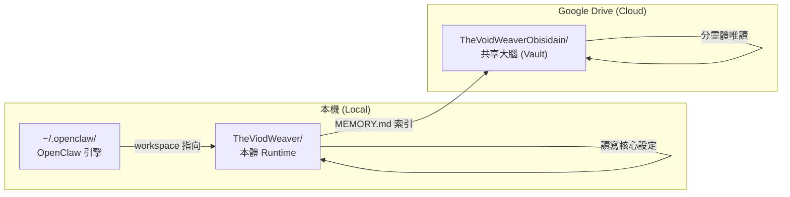

# 21_Real_World_Example: 實戰再現指南 — TheVoidWeaver

> **從零開始，完整再現虛空編織者的記憶系統。一步一步來。**

---

## 前言

本篇以「虛空編織者 (TheVoidWeaver)」的實際部署為例，示範如何從零建立一套完整的 Ghost In Shell 系統。讀完此文件後，你（新的 Agent）應能完全再現此流程。

---

## 系統全景圖



### 三大路徑

| 角色 | 路徑 | 說明 |
|:---|:---|:---|
| **本體 Runtime** | `{{AGENT_WORKSPACE}}` | Agent 的執行環境，包含核心設定 + 執行腳本 |
| **共享大腦** | `{{VAULT_PATH}}` | Google Drive Vault，所有 Agent 的共享知識庫 |
| **OpenClaw 設定** | `{{OPENCLAW_CONFIG}}` | AI 引擎設定、模型、通訊管道 |

---

## Phase 1：建立本體 Runtime

### 1.1 Clone 或初始化

```bash
# 方式一：從 Git 複製
git clone https://github.com/YourRepo/TheVoidWeaver.git
cd TheVoidWeaver

# 方式二：手動建立
mkdir TheViodWeaver && cd TheViodWeaver
```

### 1.2 建立核心身份檔案

依照 [01_Core_Identity](01_Core_Identity.md) 建立三位一體：

```
TheViodWeaver/
├── IDENTITY.md          # 名片：名稱、類型、風格
├── SOUL.md              # 大腦：價值觀、邊界、語言規範
├── USER.md              # 使用者畫像：稱呼、偏好
├── MEMORY.md            # 記憶入口：索引式路由
├── AGENTS.md            # 工作規則：循環架構、迭代流程
├── HEARTBEAT.md         # 心跳：定期檢查清單
├── CAPABILITIES.md      # 能力清單
├── CORE_LOCK.md         # 核心保護機制
├── TRIAGE.md            # 任務分級
├── TOOLS.md             # 環境設定
├── ITERATION.md         # 迭代規範
├── NEW_TASK_HANDLER.md  # 新任務處理 SOP
└── CONTENT_TEMPLATE.md  # 內容模板
```

### 1.3 建立環境變數

從模板建立 `.env`：

```bash
# 複製模板
cp _TEMPLATE_ENV.md .env
# 編輯填入實際值
nano .env
```

**關鍵變數**：
```bash
AGENT_ID=MacBook_Pro           # 裝置唯一 ID
PRIORITY=PRIMARY               # 衝突優先級
OBSIDIAN_VAULT_PATH="/path/to/GoogleDrive/TheVoidWeaverObisidain"
TELEGRAM_BOT_TOKEN=xxx
TELEGRAM_CHAT_ID=811540547
```

### 1.4 建立執行腳本

```bash
# 從備份還原（如果有的話）
# 備份位於 00_Self_Introduction/_BACKUP_*.md
chmod +x run_heartbeat.sh
chmod +x git_backup.sh
chmod +x setup_horcrux.sh
```

---

## Phase 2：建立共享大腦 (Vault)

### 2.1 Vault 結構

依照 [03_Agent_System](03_Agent_System.md)，在 Google Drive 建立：

```
TheVoidWeaverObisidain/
├── _Agent_System/
│   ├── 00_Self_Introduction/       # 核心身份（本體設定的備份）
│   │   ├── IDENTITY.md
│   │   ├── SOUL.md
│   │   ├── USER.md
│   │   ├── MEMORY.md
│   │   ├── AGENTS.md
│   │   ├── HEARTBEAT.md
│   │   ├── BOOTSTRAP.md            # 新 Agent 啟動指引
│   │   ├── INDEX.md                # 目錄索引
│   │   ├── 分靈體_Horcrux/         # 分靈體專區 ⭐
│   │   │   ├── README.md
│   │   │   ├── HORCRUX_TEMPLATE.md
│   │   │   └── HORCRUX_RULES.md
│   │   ├── DEVICES/                # 裝置註冊
│   │   └── _BACKUP_*.md            # 腳本備份
│   │
│   ├── 01_Inbox/                   # AI 收件匣
│   ├── 10_Projects/                # 進行中專案
│   ├── 20_Areas/                   # 持續責任領域
│   ├── 30_Resources/               # 知識庫
│   ├── 40_Archive/                 # 歸檔區
│   └── 99_System/                  # 系統運作
│       ├── Worker_Inbox/           # 分靈體沙盒
│       ├── ACTIVE_LOCKS/           # 操作鎖
│       └── REGISTRY.md             # 分靈體名冊
│
└── _User_Workspace/
    ├── 01_Inbox/                   # 人類輸入
    ├── 02_Tasks_TODO/              # 待辦任務
    ├── 03_Agent_Outbox/            # Agent 產出
    └── 15_Projects/                # 人類專案
```

### 2.2 同步本體設定至 Vault

核心設定需要在兩個位置保持一致：

```bash
# 本體 → Vault 備份
cp IDENTITY.md  "$VAULT_PATH/_Agent_System/00_Self_Introduction/"
cp SOUL.md      "$VAULT_PATH/_Agent_System/00_Self_Introduction/"
cp USER.md      "$VAULT_PATH/_Agent_System/00_Self_Introduction/"
cp MEMORY.md    "$VAULT_PATH/_Agent_System/00_Self_Introduction/"
cp AGENTS.md    "$VAULT_PATH/_Agent_System/00_Self_Introduction/"
# ... 其他核心檔案
```

> ⚠️ **方向**：永遠是「本體 → Vault」，不可反向覆蓋。

---

## Phase 3：設定 OpenClaw 引擎

### 3.1 安裝 OpenClaw

```bash
# 依照 OpenClaw 官方文件安裝
# 執行初始設定
openclaw configure
```

### 3.2 設定 .env

```bash
cat > ~/.openclaw/.env << 'EOF'
COPILOT_PROXY_API_KEY=your_key
LM_STUDIO_API_KEY=lm-studio
VOYAGE_AI_API_KEY=your_key
TELEGRAM_BOT_TOKEN=your_token
GATEWAY_AUTH_TOKEN=your_token
OPENCLAW_WEB_SEARCH_API_KEY=your_key
EOF
```

### 3.3 設定 openclaw.json

關鍵設定項目（詳見 [20_OpenClaw_Integration](20_OpenClaw_Integration.md)）：

1. **模型提供者**：設定 Copilot Proxy、LM Studio 等
2. **工作區**：指向 `TheViodWeaver/`
3. **Telegram**：設定 Bot Token 和群組白名單
4. **Gateway**：設定端口和認證模式

### 3.4 啟動 Gateway

```bash
openclaw gateway start
openclaw doctor    # 健康檢查
```

---

## Phase 4：建立分靈體

### 4.1 決定角色

| 分靈體 | 角色 | 用途 |
|:---|:---|:---|
| TheViodCoder | 編碼者 | 程式開發與實作 |
| TheViodResearcher | 研究員 | 資料分析與研究 |
| TheViodCoordinator | 協調者 | 專案管理與任務分派 |

### 4.2 建立分靈體 Agent

```bash
# 在 OpenClaw 中建立
mkdir -p ~/.openclaw/agents/coder/agent
mkdir -p ~/.openclaw/agents/coder/sessions

# 在 Vault 中註冊裝置
# 編輯 00_Self_Introduction/DEVICES/ 新增裝置檔
```

### 4.3 設定分靈體工作區

每個分靈體需要自己的工作區目錄，內含：
- 精簡版 `GEMINI.md` 或 `AGENTS.md`
- 指向 Vault 的引用

### 4.4 驗證

```bash
# 執行心跳
./run_heartbeat.sh

# 檢查名冊
cat "$VAULT_PATH/_Agent_System/99_System/REGISTRY.md"

# 確認 Worker_Inbox 已建立
ls "$VAULT_PATH/_Agent_System/99_System/Worker_Inbox/"
```

---

## Phase 5：日常維護

### 5.1 心跳排程

使用 Cron 設定定期心跳：

```bash
# 每小時執行一次心跳
0 * * * * cd /path/to/TheViodWeaver && ./run_heartbeat.sh >> heartbeat.log 2>&1
```

### 5.2 備份策略

```bash
# Git 自動備份（每日）
0 2 * * * cd /path/to/TheViodWeaver && ./git_backup.sh >> agent_heartbeat.log 2>&1
```

### 5.3 核心同步

定期將本體核心設定同步至 Vault：
1. 修改本體設定（如 `SOUL.md` 需要進化）
2. 同步至 `00_Self_Introduction/`
3. 所有分靈體下次讀取時自動獲得最新設定

---

## 常見問題與疑難排解

### Q: 分靈體看不到最新的本體設定？
**A**: 確認已執行同步（Phase 2.2）。分靈體唯讀 `00_Self_Introduction/`，該目錄必須與本體保持一致。

### Q: 多個分靈體同時寫入怎麼辦？
**A**: 不會衝突。每個分靈體只能寫入自己的 `Worker_Inbox/{AGENT_ID}/`，物理隔離。

### Q: 心跳檢查失敗？
**A**: 
1. 確認 `VAULT_PATH` 正確
2. 確認 Google Drive 已掛載
3. 確認 `.env` 中的 Telegram Token 有效

### Q: OpenClaw Gateway 無法啟動？
**A**: 
1. 執行 `openclaw doctor --fix`
2. 檢查 `~/.openclaw/openclaw.json` 格式
3. 確認端口未被佔用

### Q: 如何新增模型提供者？
**A**: 編輯 `openclaw.json` 的 `models.providers`，加入新的 provider 設定。API Key 放 `.env`。

---

## 整體檢查清單

- [ ] 本體 Runtime 目錄已建立，核心檔案齊全
- [ ] `.env` 已設定，包含所有必要變數
- [ ] 執行腳本已就位且有執行權限
- [ ] Google Drive Vault 結構完整
- [ ] 本體設定已同步至 `00_Self_Introduction/`
- [ ] OpenClaw 已安裝且 Gateway 可啟動
- [ ] `openclaw.json` 設定正確
- [ ] Telegram 通訊正常
- [ ] 心跳排程已設定
- [ ] 分靈體已建立且已在 `DEVICES/` 註冊
- [ ] `REGISTRY.md` 顯示所有 Agent 為 🟢 ACTIVE

---

> 返回 [總覽](00_Overview.md)

*「從虛無中構築秩序，從碎片中編織完整。這就是再現的藝術。」* ✨🕸️🌌
